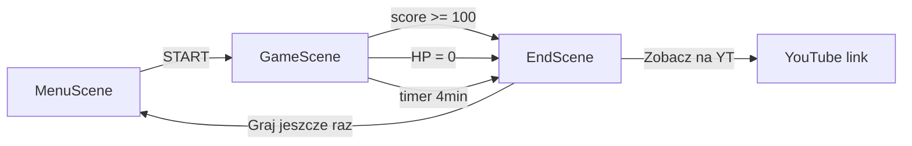
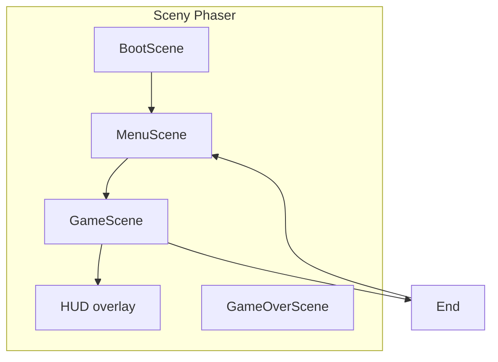

# Plan: Firewall — retro grid shoot 'em up

## Wizja gry

**Firewall** to top-down arcade w stylu Galaxy Attack, ale z motywem cyberbezpieczeństwa: gracz pilotuje **statek-tarczę** (nie „działo w kosmosie”, tylko **aktywna obrona**). Główna mechanika to **odpychanie** wrogów polem tarczy; strzelanie i inne bonusy są **power-upami**, nie domyślnym trybem.

| Galaxy Attack         | Firewall                                                           |
| --------------------- | ------------------------------------------------------------------ |
| Statek + ciągły ogień | Tarcza + odpych (domyślnie)                                        |
| Obcy                  | Wirusy, konie trojańskie, ransomware, botnety                      |
| Boss kosmiczny        | „Rootkit Overlord”, „DDoS Hive” itd.                               |
| Power-upy             | Firewall Boost, Packet Stream (strzał), Immunity (niesmiertelność) |

**Platforma:** przeglądarka (Vite + TypeScript).  
**Sterowanie:** klawiatura (strzałki / WASD + spacja opcjonalnie na aktywację tarczy).

**Czas sesji:** gra jest **krótka** (kilka minut), nie endless arcade. Średni gracz powinien móc zdobyć **100 punktów w ok. 2 minut**; po zakończeniu rundy (wygrana, porażka lub limit czasu) — **ekran końcowy z linkiem do YouTube**.

---

## Stack technologiczny

| Warstwa         | Wybór                                             | Uzasadnienie                                                               |
| --------------- | ------------------------------------------------- | -------------------------------------------------------------------------- |
| Bundler         | Vite 6 + TypeScript                               | Szybki dev, zero konfiguracji na start                                     |
| Silnik          | **Phaser 3**                                      | Sceny, fizyka Arcade, grupy wrogów, particles, kamery — standard pod shmup |
| Testy (później) | Vitest + testy czystej logiki fal/punktów         | Bez renderu Phasera                                                        |
| Deploy          | Statyczny build → GitHub Pages / Cloudflare Pages | `npm run build`                                                            |

**Zależności startowe:** `phaser`, dev: `typescript`, `vite`.

---

## Estetyka „retro grid”

Agent implementujący UI/art **musi** trzymać się tego briefu:

- Tło: **animowana siatka perspektywiczna** (neon cyan/magenta na ciemnym `#0a0e17`), lekki scroll — shader lub tile sprite w warstwie tła sceny `Game`.
- Paleta: cyan `#00f0ff`, magenta `#ff00aa`, żółty ostrzegawczy `#ffcc00`, zielony „OK” `#00ff88`.
- Postacie: **proceduralne kształty geometryczne** + prosty pixel font (np. `"Press Start 2P"` z Google Fonts) — bez zewnętrznych assetów w MVP.
- Efekty: scanline overlay (canvas alpha), krótkie **screen shake** przy trafieniu, **flash** przy power-upie.
- **Muzyka:** jedna ścieżka **MP3** w pętli podczas gry (retro/synth pasujący do gridu); krótkie SFX opcjonalnie później.





---

## Mechanika rdzenia

### Gracz (ShieldCraft)

- Pozycja: dolna 1/3 ekranu; ruch **tylko w poziomie** (klasyczny shmup) lub pełny X/Y — rekomendacja: **X + lekki Y** w dolnej strefie (80% wysokości od dołu).
- **Pole tarczy:** okrąg/ellipse przed statkiem, aktywne gdy trzymasz `Space` lub zawsze włączone (MVP: **zawsze włączone**, `Space` = „Pulse” — krótki impuls odpychu 2× siły, cooldown 1.5s).
- **Odpych:** wrogowie w zasięgu tarczy dostają wektor od gracza + obrażenia kontaktowe; nie giną od razu, chyba że HP = 0.
- **Kolizja ciała statku:** strata życia / krótka niewrażliwość (i-frames 1.5s).

### Wrogowie (malware)

| Typ               | Zachowanie                                              | Wzrost w czasie                    |
| ----------------- | ------------------------------------------------------- | ---------------------------------- |
| `Virus`           | Prosty spawn, leci w dół, małe HP                       | +HP co 30s globalnie               |
| `Trojan`          | Wolniejszy, większy hitbox, raz na 3s „charge” w gracza | Skaluje rozmiar sprite co falę     |
| `Worm`            | Ruch sinusoidalny                                       | Szybszy ruch co fale               |
| `Spyware`         | Strzela „pakietami” (małe pociski)                      | Więcej pocisków na wyższych falach |
| **Boss** co 5 fal | Wiele faz, wzorce pocisków                              | Osobna tabela HP                   |

**Globalny scaling:** `difficultyMultiplier = 1 + (wave * 0.08) + (elapsedMinutes * 0.05)` — HP, prędkość i częstotliwość spawnu rosną.

### Punktacja i długość rundy

**Stałe w** [`src/config.ts`](src/config.ts):

| Stała | Wartość | Znaczenie |
|---|---|---|
| `TARGET_SCORE` | `100` | Wygrana — przejście na ekran końcowy |
| `SESSION_MAX_MS` | `240_000` (4 min) | Twardy limit; koniec rundy nawet przy życiu |
| `TUNING_GOAL_MS` | `120_000` (2 min) | Cel balansu: typowy gracz ~100 pkt |

**Punktacja:**

- `Virus`: **10 pkt** (bazowo)
- `Trojan`: **20 pkt**
- `Worm` / `Spyware`: **15 pkt**
- **Combo:** kolejne zabójstwa w 2s — mnożnik do ×3 (nie ×5, żeby nie rozjechać 2-min celu)
- Przejście fali: **+25 pkt** (mały bonus, nie +500×fala — za dużo na krótką sesję)
- Boss (jeśli zdąży przed 100 pkt): **+40 pkt** jednorazowo

**Szacunek pod 2 min → 100 pkt:** ~8–10 zabitych wirusów (80–100) + 1–2 combo lub 1 trojan ≈ 100. Spawn w falach 1–3: **1 wróg / ~10–12 s** przy Virus 10 pkt; po tuningu playtest — doprecyzować `interval` w `waves.json`.

**Koniec gry (wszystkie ścieżki → `EndScene`):**

1. **Wygrana:** `score >= TARGET_SCORE` → komunikat „Firewall aktywny!” / „Baza oczyszczona!”
2. **Porażka:** `HP = 0`
3. **Czas:** `elapsed >= SESSION_MAX_MS` → komunikat „Czas minął” + aktualny wynik

Na `EndScene` zawsze: wynik, przycisk **„Zagraj jeszcze raz”**, oraz **link/przycisk do YouTube** (otwarcie w nowej karcie).

### Power-upy (drop z wrogów ~12%)

| Power-up         | Efekt                                    | Czas        |
| ---------------- | ---------------------------------------- | ----------- |
| `PacketStream`   | Włącza auto-fire w przód (3 pociski/sek) | 8s          |
| `Immunity`       | Niesmiertelność + wizualna aura          | 5s          |
| `ShieldBoost`    | Promień tarczy ×1.5, obrażenia ×2        | 10s         |
| `FirewallRepair` | +1 życie (max 5)                         | natychmiast |

---

## Struktura projektu (od zera)

```
firewall_game/
├── index.html
├── package.json
├── tsconfig.json
├── vite.config.ts
├── public/
│   └── audio/
│       └── music.mp3          # ścieżka dźwiękowa (dostarcza właściciel repo)
└── src/
    ├── main.ts                 # Phaser.Game config
    ├── config.ts               # rozdzielczość, kolory, stałe
    ├── scenes/
    │   ├── BootScene.ts
    │   ├── MenuScene.ts
    │   ├── GameScene.ts
    │   └── EndScene.ts          # wynik + link YT (zamiast osobnego GameOver)
    ├── entities/
    │   ├── Player.ts
    │   ├── Enemy.ts            # klasa bazowa
    │   ├── enemies/            # Virus, Trojan, Worm, Spyware
    │   └── Boss.ts
    ├── systems/
    │   ├── ShieldSystem.ts     # odpych + zasięg + obrażenia
    │   ├── SpawnSystem.ts      # fale, timeline
    │   ├── CollisionSystem.ts
    │   ├── PowerUpSystem.ts
    │   ├── ScoreSystem.ts
    │   ├── AudioSystem.ts       # muzyka MP3 + mute
    │   └── SessionTimer.ts      # 4 min cap, win @ 100 pkt
    ├── data/
    │   ├── waves.json          # definicje fal 1–20
    │   └── bosses.json
    ├── ui/
    │   ├── HUD.ts
    │   └── RetroGridBackground.ts
    └── utils/
        ├── objectPool.ts
        └── storage.ts          # high score
```

---

## Fazy implementacji (vertical slices)

### Faza 1 — Playable core (1–2 sesje)

- Szkielet Vite + Phaser, `BootScene` → `GameScene`.
- `RetroGridBackground` (scrolling grid).
- `Player` + ruch klawiaturą (`cursors` / WASD).
- `ShieldSystem`: overlap z wrogami → knockback + damage.
- Jeden typ wroga `Virus`, spawn co N sekund.
- HP gracza (3), game over, prosty HUD (score, życia).

**Kryterium done:** da się grać, zabijać wirusy tarczą, umierać przy kontakcie; HUD pokazuje score i timer do 4 min.

### Faza 2 — Fale, typy, combo

- `SpawnSystem` + `waves.json` (fale 1–10 z rosnącą trudnością).
- Trojan, Worm, Spyware z różnym AI.
- `ScoreSystem` + combo.
- `MenuScene` (START, HIGH SCORE).
- `SessionTimer` + auto-win przy 100 pkt.
- `EndScene` (retry + **link YouTube**).

### Faza 3 — Power-upy i strzelanie

- Drop power-upów, timery buffów.
- `PacketStream` — grupa pocisków gracza (`Phaser.Physics.Arcade.Group`).
- Immunity i i-frames bez konfliktów.

### Faza 4 — Audio MP3 + ekran końcowy YT

- Plik [`public/audio/music.mp3`](public/audio/music.mp3) — użytkownik wrzuca własny track; w repo placeholder lub `.gitkeep` + opis w README.
- `BootScene`: `this.load.audio('bgm', '/audio/music.mp3')`.
- `AudioSystem`: loop w `GameScene`, kontynuacja lub cisza w menu; **M** = mute (zapis w `localStorage`).
- `EndScene`: wynik, przyczyna końca (100 pkt / śmierć / czas), przycisk **„Obejrzyj na YouTube”** → `window.open(YOUTUBE_URL)`.
- Stała w [`src/config.ts`](src/config.ts): `export const YOUTUBE_URL = 'https://www.youtube.com/watch?v=XXXXXXXX'` (podmiana przed deployem).

### Faza 5 — Bossy i polish

- Boss opcjonalny tylko jeśli sesja trwa >2 min bez osiągnięcia 100 pkt (krótki mini-boss, nie rozbudowany raid).
- Pulse (`Space`), particles, screen shake.
- **Playtest balansu:** średni gracz ~100 pkt w 90–150 s; tuning `waves.json`.
- Zapis high score w `localStorage`.

### Faza 6 (opcjonalnie) — Jakość życia

- Pauza (`P`), mobile warning („użyj klawiatury”).
- Proste testy Vitest dla `ScoreSystem` (np. „10 virusów ×10 = win threshold”).

---

## Kluczowe fragmenty do zaimplementowania

**Konfiguracja Phaser** ([`src/main.ts`](src/main.ts)):

```ts
const config: Phaser.Types.Core.GameConfig = {
  type: Phaser.AUTO,
  width: 480,
  height: 800,
  scale: { mode: Phaser.Scale.FIT, autoCenter: Phaser.Scale.CENTER_BOTH },
  physics: { default: "arcade", arcade: { gravity: { y: 0 } } },
  scene: [BootScene, MenuScene, GameScene, EndScene],
};
```

**YouTube + audio w config** — [`src/config.ts`](src/config.ts):

```ts
export const TARGET_SCORE = 100;
export const SESSION_MAX_MS = 4 * 60 * 1000;
export const YOUTUBE_URL = "https://www.youtube.com/watch?v=XXXXXXXX"; // podmień
export const BGM_KEY = "bgm";
export const BGM_PATH = "/audio/music.mp3";
```

**Preload MP3** — [`src/scenes/BootScene.ts`](src/scenes/BootScene.ts):

```ts
this.load.audio(BGM_KEY, BGM_PATH);
```

**Start muzyki** — [`src/systems/AudioSystem.ts`](src/systems/AudioSystem.ts):

```ts
this.bgm = scene.sound.add(BGM_KEY, { loop: true, volume: 0.5 });
if (!getMuted()) this.bgm.play();
```

**Odpych (rdzeń gry)** — [`src/systems/ShieldSystem.ts`](src/systems/ShieldSystem.ts):

```ts
// Pseudokod: dla każdego wroga w promieniu shieldRadius
const dir = enemy.body.center.subtract(player.body.center).normalize();
enemy.setVelocity(dir.x * pushForce, dir.y * pushForce);
enemy.applyDamage(shieldDamage * delta);
```

**Przykładowa fala** — [`src/data/waves.json`](src/data/waves.json):

```json
{
  "waves": [
    { "id": 1, "spawns": [{ "type": "virus", "count": 8, "interval": 1200 }] },
    {
      "id": 2,
      "spawns": [
        { "type": "virus", "count": 10 },
        { "type": "trojan", "count": 2, "delay": 5000 }
      ]
    }
  ]
}
```

---

## Sterowanie (klawiatura)

| Klawisz   | Akcja                                |
| --------- | ------------------------------------ |
| ← → / A D | Ruch w poziomie                      |
| ↑ ↓ / W S | Ruch w pionie (w dozwolonej strefie) |
| Spacja    | Pulse tarczy (cooldown)              |
| P         | Pauza (faza 5)                       |
| Enter     | Start / Retry w menu                 |

---

## Balans startowy (do tuningu w grze)

- Rozdzielczość logiczna: **480×800** (portrait jak mobile shmup).
- Gracz: 3 HP, prędkość 280 px/s, `shieldRadius` 70px, `pushForce` 320.
- Virus: 2 HP, 90 px/s w dół, **10 pkt**.
- **Fale 1–4** mieszczą się w ~2–3 min (ograniczona liczba spawnów, nie nieskończony stream).
- **Playtest:** jeśli 100 pkt < 90 s → rzadszy spawn; jeśli > 3 min → więcej wrogów lub +5 pkt za Virus.
- Boss: tylko w sesjach >3 min bez wygranej — mini-boss ~40 HP, nie pełna fala 5 jak w długim shmupie.

---

## README i konwencje dla agentów

W [`README.md`](README.md) na starcie projektu:

- `npm install` / `npm run dev` / `npm run build`
- Sekcja **„Retro grid brief”** — skopiować paletę i zasady wizualne z tego planu
- Opis mechaniki: **tarcza domyślna, strzał = power-up**
- Mapa folderów `src/`
- **`public/audio/music.mp3`** — wymagany asset od autora; bez pliku gra działa, muzyka wyciszona z komunikatem w konsoli
- **`YOUTUBE_URL`** — placeholder do podmiany przed publikacją

**Zasada dla agentów implementujących:** nie dodawać ciągłego auto-fire bez power-upu; nie zmieniać motywu na generic space bez uzgodnienia; nowi wrogowie = metafora malware (nazwa + zachowanie opisane w komentarzu).

---

## Ryzyka i decyzje zamknięte

- **Pusta baza** — cały kod od zera; brak migracji.
- **Brak sprite sheet na start** — graphics API Phasera (`fillStyle`, `fillCircle`, `generateTexture`) wystarczy na MVP.
- **Tylko klawiatura** — bez touch w v1 (zgodnie z wyborem użytkownika).
- **Język UI:** polskie menu („START”, „WYNIK”, „KONIEC GRY”) pasuje do motywu edukacyjnego.
- **Krótka sesja** — nie rozbudowywać pod 20+ min; każda nowa mechanika musi przejść test „czy da się wygrać w ~2–4 min”.
- **YouTube** — link tylko na `EndScene`, nie przerywać rozgrywki; `rel=noopener` przy `window.open`.
- **MP3** — jeden plik w `public/audio/`; nie osadzać ciężkiego wideo w grze, tylko link na zewnątrz.
